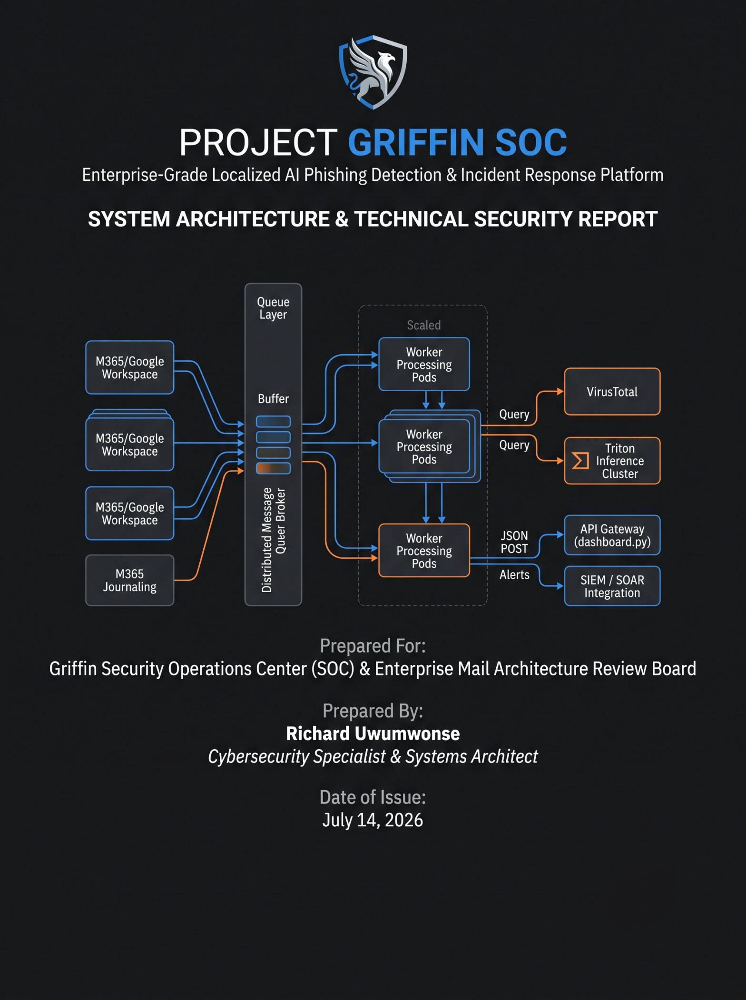
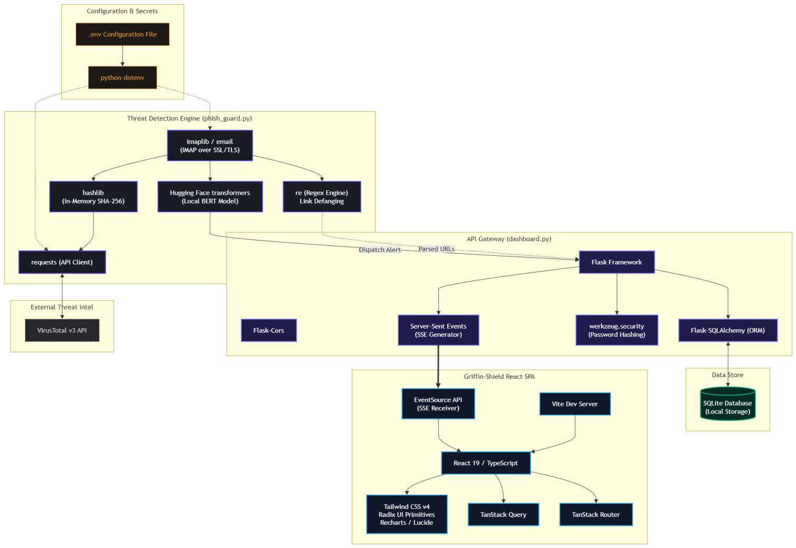
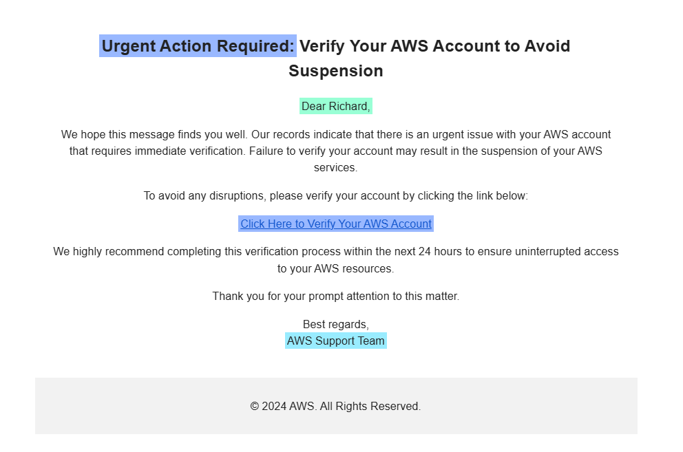
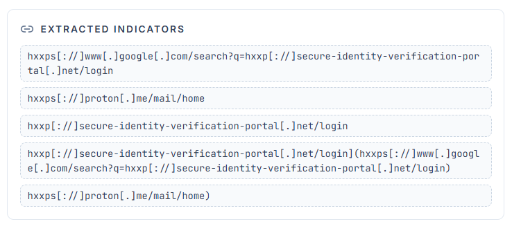
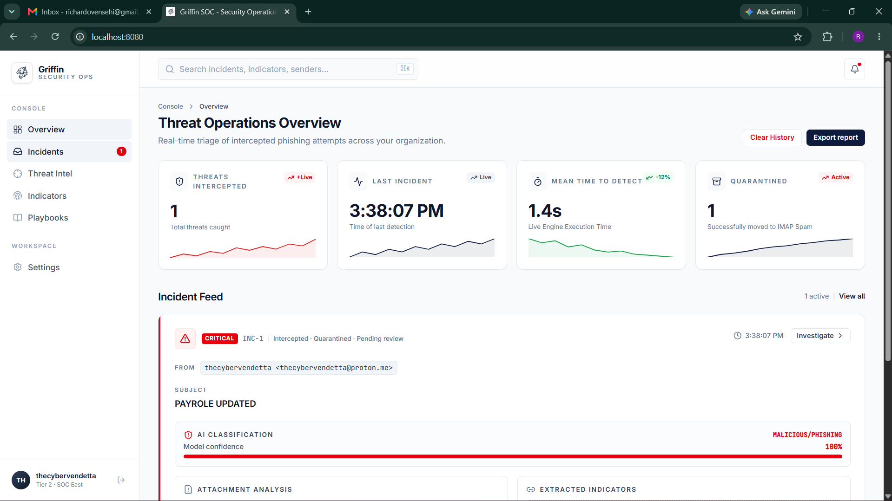
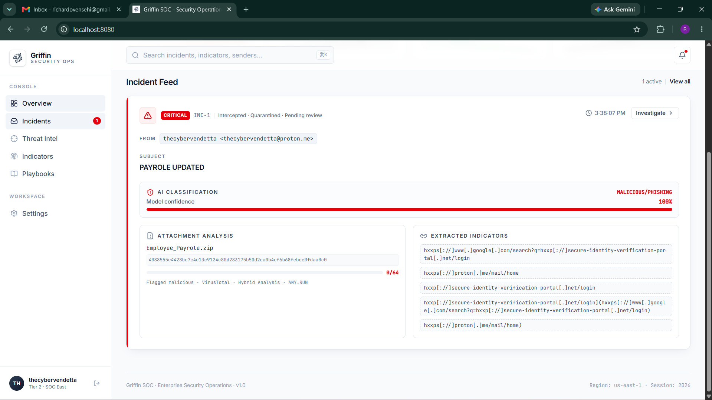
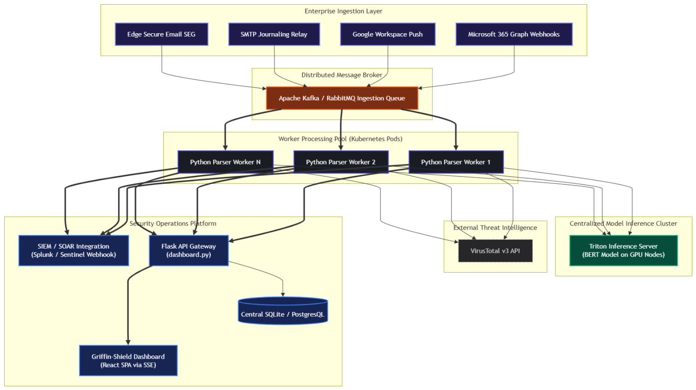

# Griffin SOC (PhishGuard): AI-Automated Phishing Gateway

**Project:** Custom Security Operations Center (SOC) Tooling  
**Role:** DevSecOps Engineer / SOC Developer  
**Technologies:** React, Python, Artificial Intelligence (NLP), HuggingFace BERT, VirusTotal API, SQLite, Docker, IMAP Protocols, SOAR  

## 📌 1. Executive Summary
The Griffin SOC platform represents a major advancement in local defensive architecture. This project involved architecting an event-driven, AI-automated phishing email gateway capable of actively monitoring inboxes, defanging malicious indicators of compromise (IOCs), and triaging threats using Natural Language Processing (NLP). By removing external webhook notification dependencies and utilizing localized, stateful microservices, the platform achieves robust protection with minimal latency, paired with a React frontend (Griffin-Shield) for real-time monitoring and forensic triage.



---

## 🏗️ 2. Core Engineering Mechanics: IMAP & Network Protocol Analysis

Optimizing IMAP performance was a core requirement to ensure the gateway could operate indefinitely without crashing or disrupting user email workflows.

### 2.1 Implementation of `BODY.PEEK[ ]`
In traditional mail processors, fetching an email payload with RFC822 automatically tells the IMAP server to mark the message as `\Seen` (Read). This creates a critical business impact: the end-user misses native unread notifications on their mobile and desktop clients.

Griffin SOC solves this by explicitly utilizing the PEEK command:
```python
mail.uid('fetch', uid, '(BODY.PEEK[])')
```
This retrieves the complete payload structure but forces the IMAP server to leave the `\Seen` flag untouched.

### 2.2 Local Memory-State Management
Because messages remain unread in the inbox, a recurring UNSEEN query would loop continuously over the same emails. To prevent redundant semantic operations, a local runtime set named `PROCESSED_UIDS` tracking processed email UIDs is implemented.
```python
PROCESSED_UIDS &= active_uids
```
This intersection ensures that once a user manually marks a message as read elsewhere, its UID is automatically pruned from memory, preventing memory leaks while keeping inbox alerts perfectly synced.



---

## ⚔️ 3. Threat Modeling & Defensive Mechanics

### 3.1 Regex and Defanging Logic
The regular expression rules utilized in Griffin SOC are designed to extract targets while eliminating dirty structural metadata.

*   **Plain-Text URL Scan:** `(?:https?://|www\.)[^\s<>"]+`
    *Isolates standard web links while stopping at character delimiters.*
*   **HTML Link Scan:** `href=["\'](https?://[^"\'>\s]+|www\.[^"\'>\s]+)["\']`
    *Explicitly extracts targets buried inside HTML href structures.*

To safely display these IOCs in the React client, the script defangs the URL string:
```python
defanged_url = safe_url.replace(".", "[.]").replace("://", "[://]").replace("http", "hxxp")
```
This forces all extracted targets into static text fields, satisfying defensive triage requirements while maintaining technical readability.



---

## 💻 4. Analytical Functionality & Administrative Controls

The React frontend (**Griffin-Shield**) is optimized for real-time monitoring, parsing, and forensic triage of received threats:

*   **Live Metrics:** High-level key performance indicators (KPIs) track cumulative threats intercepted and quarantined, backed by Recharts sparklines showing trending incident velocity.
*   **Progressive Threat Gauges:** Incident cards render visual metrics tracking VirusTotal detection rates, dynamically highlighting high-risk attachments based on the proportion of vendor flags.
*   **Data Export (CSV):** Allows instant compiler extraction of logged incidents from SQLite. This feature exports the dataset as a structured CSV for offline compliance logging or threat intelligence sharing.
*   **Purge Controls (Clear History):** Wipes active logs from the SQLite database and resets the analyst's dashboard array, ensuring seamless operational transitions between shift rotations.




---

## 🌐 5. Enterprise Integration and Scalability Architecture

To migrate this pipeline from a single-mailbox monitor to an enterprise-grade corporate system, the architecture is designed to transition from basic IMAP polling to a high-throughput, distributed ingestion model.

### 5.1 Distributed Microservices Design
To process hundreds of thousands of daily emails, the single-thread loop is split into a decoupled microservices platform:
*   **Message Broker (Queue Layer):** Email metadata and payloads are pushed directly into Apache Kafka or RabbitMQ topics.
*   **Stateless Processing Containers:** Worker services deployed via Docker and scaled via Kubernetes subscribe to the message queues, dynamically consuming payloads to run URL extraction and in-memory file hashing.
*   **Centralized Inference Cluster:** Instead of loading BERT weights into each container, the NLP model (`Auguzcht/securisense-phishing-detection`) is hosted on a high-availability Triton Inference Server cluster. Workers query this centralized API via fast gRPC endpoints.

### 5.2 Structured SOC Dashboard Integration
When PhishGuard classifies a threat, it generates a standard JSON payload and dispatches it via a REST API webhook to a central SIEM (Splunk, Elastic, Microsoft Sentinel).

```json
{
  "event_id": "evt_98f1c149afbf4c89",
  "timestamp": "2026-07-14T09:15:00Z",
  "severity": "HIGH",
  "recipient": "employee@corporate.com",
  "analysis": {
    "nlp_verdict": "PHISHING",
    "nlp_confidence": 0.985,
    "model_id": "Auguzcht/securisense-phishing-detection"
  },
  "indicators": {
    "extracted_urls": [
      {
        "raw": "http://corporate-login-update.net/login",
        "defanged": "hxxp[://]corporate-login-update[.]net/login"
      }
    ],
    "attachments": [
      {
        "filename": "invoice_copy.pdf",
        "sha256": "275a021bbfb6489e54d471899f7db9d1663fc695ec2fe2a2c4538aabf651fd0f",
        "virustotal_malicious_engines": 42
      }
    ]
  }
}
```

### 5.3 Automated SOC Playbooks (SOAR)
Once ingested by the SIEM/SOAR engine, automated remediation playbooks are executed instantaneously:
*   **High NLP Confidence Trigger:** The SOAR platform calls the Microsoft 365 / Google Workspace API to silently purge the target email from the user's inbox.
*   **Malicious Attachment Match:** The SHA-256 hash is pushed to active corporate EDR agents (e.g., CrowdStrike Falcon, Microsoft Defender for Endpoint) to quarantine matching files across all endpoints.
*   **Domain Reputation Mitigation:** The defanged URL is pushed directly to the enterprise secure DNS web gateways (e.g., Cisco Umbrella) to immediately block domain resolution across the corporate network.




---

## 🛡️ 6. Conclusions and Enterprise Hardening Recommendations

The Griffin SOC platform represents a major advancement in automated defensive architecture. To further scale the application for enterprise corporate compliance, I recommend the following controls:

1.  **Local API Key Storage Encryption:** Transition from plaintext environment variable storage (`.env` file) to a local secret manager or OS keyring (e.g., Windows Credential Manager or macOS Keychain).
2.  **Containerization and Sandboxing:** Bundle the API backend, background worker, and React build target into isolated, rootless Docker containers running on a restricted private virtual network.
3.  **Encrypted Local Sessions:** Upgrade local session tracking in the React client, transitioning from unencrypted `localStorage` states to cryptographically signed JWT tokens or secure session cookies.


## Key Features
- **AI Text Classification**: Uses a local Hugging Face Transformer model (`Auguzcht/securisense-phishing-detection`) to classify email bodies as Phishing or Safe.
- **Threat Intelligence**: Automatically extracts file attachments, generates SHA-256 hashes, and queries the VirusTotal API to detect malware.
- **Active Quarantine**: Instantly intercepts threats and issues IMAP commands to move malicious emails out of the Inbox and into the Spam folder before the user can interact with them.
- **Real-Time Dashboard**: A React SPA that consumes Server-Sent Events (SSE) from the backend to render a live incident feed.
- **IoC Extraction**: Uses Regex to extract and "defang" malicious URLs for safe viewing by analysts.

---

## Tech Stack
- **Detection Engine**: Python 3, `imaplib`, `transformers`, `requests`
- **API Server**: Flask, Flask-SQLAlchemy (SQLite), Server-Sent Events
- **Frontend Dashboard**: React 19, Vite, Tailwind CSS v4, TanStack Router
- **Authentication**: `werkzeug.security` (Password hashing)

---

## Setup & Installation

### 1. Prerequisites
- **Python 3.8+**
- **Node.js 18+**
- A Gmail account with an **App Password** generated (Standard passwords will not work).
- A **VirusTotal API Key** (Free tier works).

### 2. Backend Setup
Clone the repository and install the Python dependencies:

```bash
git clone https://github.com/your-username/griffin-soc.git
cd griffin-soc

# Create a virtual environment (optional but recommended)
python -m venv venv
source venv/bin/activate  # On Windows use: venv\Scripts\activate

# Install requirements
pip install -r requirements.txt
```

Create a `.env` file in the root of the project with the following credentials:
```env
EMAIL="your-email@gmail.com"
GMAIL_APP_PASSWORD="your-16-digit-app-password"
VT_API_KEY="your-virustotal-api-key"
```

### 3. Frontend Setup
Navigate into the frontend directory and install the Node modules:

```bash
cd Griffin-Shield
npm install
```

---

## Running the Application

To run the full Griffin SOC environment locally, you will need to open **two separate terminal windows**:

**Terminal 1: Start the Backend (API Server & Detection Engine)**
```bash
python dashboard.py
```
*(This starts the Flask REST API and automatically spawns the `phish_guard.py` detection engine in the background).*

**Terminal 2: Start the React Frontend**
```bash
cd Griffin-Shield
npm run dev
```

Finally, open your browser and navigate to `http://localhost:8080/`. You will be prompted to register an Analyst account before you can view the live feed.

---

## Security Notice
This project stores session states locally and relies on an unencrypted SQLite database. Do not deploy the API to a public cloud environment without implementing proper JWT authentication, CORS restrictions, and SSL/TLS encryption.
